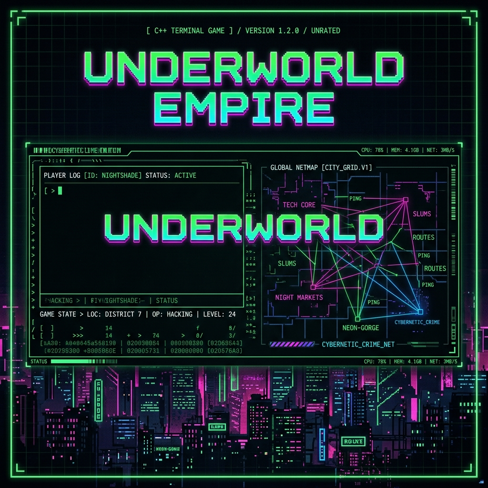
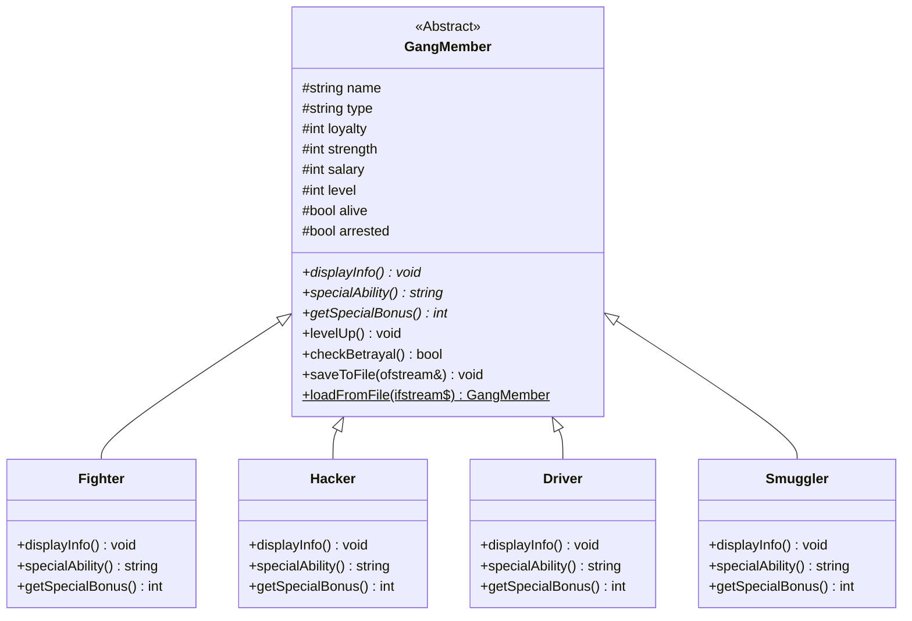
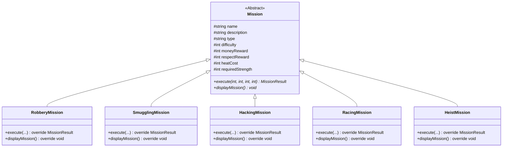

# Underworld Empire Management System

<p align="center">
  
</p>

<p align="center">
  
  
  
  
</p>

---

## 🌌 Overview

The **Underworld Empire Management System** is a terminal-based, cinematic strategy simulation game built in **C++** using advanced **Object-Oriented Programming (OOP)** principles. 

Set in a retro-futuristic cyberpunk metropolis, you play as an aspiring crime boss starting with zero territory and a clean sheet. Your objective: build a dominant syndicate, claim city zones, recruit specialized operatives, execute complex high-stakes operations, buy black market gear, manage police heat, and defend your operations against rival cartels.

---

## ✨ Features

- **🎮 Cinematic Text UI Engine**: ANSI escape codes provide smooth colors, animated typewriter effects, flashing warnings, visual custom progress bars, and custom grid borders.
- **👥 Polymorphic Crew Management**: Recruit and manage 4 specialized roles (`Fighter`, `Hacker`, `Driver`, `Smuggler`), each inheriting from an abstract base class with distinct capabilities, salaries, and special abilities.
- **🗺️ Interactive City Map**: Claim and protect a dynamic grid of 8 unique territories generating turn-based income. Defend them against rival gang invasions by upgrading fortifications.
- **🚨 Polymorphic Missions**: Execute 5 distinct operation types (`Robbery`, `Smuggling`, `Hacking`, `Racing`, `Heist`), each with custom success formulas, reward weightings, risk profiles, and unique narrative results.
- **🚓 Escalating Police System**: Heat levels dynamically rise with criminal activity. High heat triggers SWAT raids, assets frozen, and territory locks unless mitigated via bribes or cyber hacks.
- **🤖 Rival Cartel AI**: Computer-controlled factions actively contest zones, execute operations, block your income streams, and launch territory counter-attacks.
- **🛒 Cyber Black Market**: Buy from 16 unique items categorized into Weapons, Armor, Vehicles, and Intel to permanently boost crew performance.
- **📰 Dynamic Event Ticker**: 16 random world events (informant leaks, stock market crashes, warehouse fires, money laundering windfalls) that shift game variables every turn.
- **💾 Local Save & Load System**: Pipe-delimited file serialization to save progress locally and resume later.

---

## 🛠️ Tech Stack & OOP Architecture

This project is built from scratch utilizing the following software engineering paradigms:

### 🧩 System Architecture (Mermaid Class Diagrams)

#### 1. Crew Class Hierarchy (`GangMember`)


#### 2. Mission Class Hierarchy (`Mission`)


---

## 🔍 OOP Code Highlights

Here are key examples of how inheritance, abstraction, and dynamic polymorphism are implemented:

### 1. Abstract Base Class & Polymorphism: `GangMember`
The game maintains a roster of `GangMember` pointers. When iterating through the crew, the virtual function binding dynamically resolves the subclass at runtime:

```cpp
// Iterate through the crew and execute specialized abilities
for (auto* member : crew) {
    if (member->isAlive() && !member->isArrested()) {
        // Dynamic binding displays subclass specific details and applies bonuses
        member->displayInfo(); 
        std::cout << "Ability: " << member->specialAbility() << std::endl;
        totalBonus += member->getSpecialBonus();
    }
}
```

### 2. Base Class Construction with Derived Overrides: `Mission`
Derived mission types pass specialized initialization data to the base constructor and override the `execute` method to run custom success algorithms:

```cpp
// Constructor for a specific Smuggling Mission
SmugglingMission::SmugglingMission(const std::string& name, int difficulty, int reward)
    : Mission(name, "Transport illegal black market cybernetics across state borders.", 
              "Smuggling", difficulty, reward, difficulty * 1.5, 12, difficulty * 8) {}

// Custom execution logic for smuggling operations
MissionResult SmugglingMission::execute(int teamStrength, int specialBonus, int heatLevel, int memberCount) {
    // Escape-focused formulas factoring in Smuggler skills & Drivers
    double escapeModifier = 1.0 + (specialBonus / 100.0);
    double successChance = ((teamStrength * escapeModifier) / (difficulty * 1.2)) * 100.0;
    
    // Result resolution logic...
}
```

---

## 🎮 Core Game Systems

### 1. Player Progression & Ranks
Your rank scales automatically based on your resources (Cash and Respect), moving from **Street Rat** up to **Kingpin**:
$$\text{Street Rat} \rightarrow \text{Hustler} \rightarrow \text{Enforcer} \rightarrow \text{Boss} \rightarrow \text{Kingpin}$$

### 2. Crew Management
Hire crew members from the dynamic market. Each class offers unique turn-based modifiers and mission boosts:
- ⚔️ **Fighter**: Boosts territory defense, and operational firepower.
- 💻 **Hacker**: Reduces global police heat every turn and unlocks high-yield hacks.
- 🚗 **Driver**: Increases escape chances on failure and improves racing speed.
- 📦 **Smuggler**: Boosts income rates across all owned territories.

*Note: Operatives have a loyalty stat. Low loyalty may cause them to pocket syndicate money, leak Intel to rival gangs, or tip off the police.*

### 3. Territory Domination
Own and upgrade a city grid containing **8 unique territories**:
1. *Downtown Core*
2. *The Docks*
3. *Industrial Sector*
4. *Neon Strip*
5. *Suburbs*
6. *Chemical Yards*
7. *Finance District*
8. *Ghetto Outpost*

Upgrade **Defense Levels** in owned territories to block rival syndicate invasions.

### 4. Police Intensity & SWAT Raids
As your Heat index reaches critical numbers:
- **Heat > 40**: Fines and investigation warnings.
- **Heat > 60**: Faction assets and cash are seized.
- **Heat > 80**: SWAT Raids take place, causing direct gunfights, crew arrests, and territory lockdowns.

---

## 🛒 Cyber Black Market

Purchase 16 items categorized to bolster your crew and operations:

| Category | Item Name | Cost | Attribute Boost |
| :--- | :--- | :--- | :--- |
| **Weapons** | Heavy Combat Rifle | $12,000 | +15 Base Team Strength |
| **Weapons** | Tactical Shotgun | $8,500 | +10 Base Team Strength |
| **Weapons** | Cyber-Blade | $5,000 | +5 Base Team Strength |
| **Weapons** | Smart Sniper | $20,000 | +25 Base Team Strength |
| **Armor** | Kevlar Vest | $4,000 | +5 Defense Multiplier |
| **Armor** | Exosuit Chassis | $18,000 | +20 Defense Multiplier |
| **Armor** | Nanoshield Matrix | $30,000 | +35 Defense Multiplier |
| **Armor** | Riot Shield | $7,500 | +10 Defense Multiplier |
| **Vehicles** | Muscle Car | $15,000 | +10% Escape Chance |
| **Vehicles** | Armored Van | $25,000 | +15% Escape Chance, +5 Defense |
| **Vehicles** | Superbike | $10,000 | +8% Escape Chance |
| **Vehicles** | Hypercar | $50,000 | +25% Escape Chance |
| **Intel** | Encrypted Decoy | $8,000 | -10 Heat Cost per turn |
| **Intel** | Police Tracker | $15,000 | -15 Heat Cost per turn |
| **Intel** | Signal Jammer | $25,000 | -25 Heat Cost per turn |
| **Intel** | Fake IDs | $5,000 | -5 Heat Cost per turn |

---

## 🚀 Building and Running the Game

### Prerequisites
- A compiler supporting C++11, C++14, or C++17 (e.g. GCC, MSVC, Clang).

### 🖥️ Windows Build (g++)
1. Clone or download the repository to your system.
2. Open a terminal (`cmd` or `powershell`) in the directory.
3. Run the automated build script:
   ```cmd
   build.bat
   ```
4. Start the game:
   ```cmd
   UnderworldEmpire.exe
   ```

### 🐧 Linux / macOS Build
1. Open your terminal in the directory.
2. Compile the source modules:
   ```bash
   g++ -std=c++11 -o UnderworldEmpire main.cpp member.cpp territory.cpp mission.cpp police.cpp rivalgang.cpp blackmarket.cpp news.cpp player.cpp game.cpp game_menus.cpp -O2
   ```
3. Run the executable:
   ```bash
   ./UnderworldEmpire
   ```

---

## 💾 Game State & Data Serialization
Save data is serialized inside `save/savegame.txt` using a safe pipeline-delimited structure (`|`). 

To load your operations, choose **Option 2 (Load Saved Operation)** on the boot screen or use **Option 9** in the command center.
